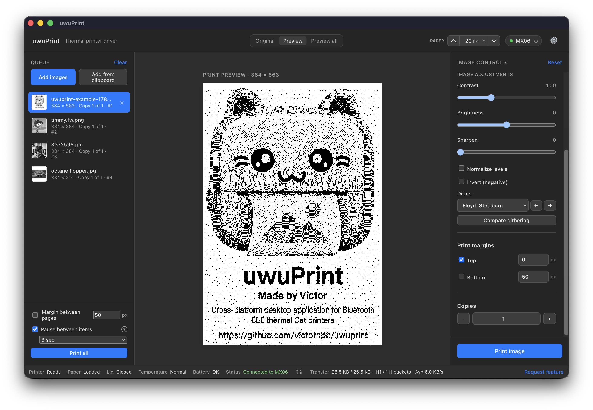
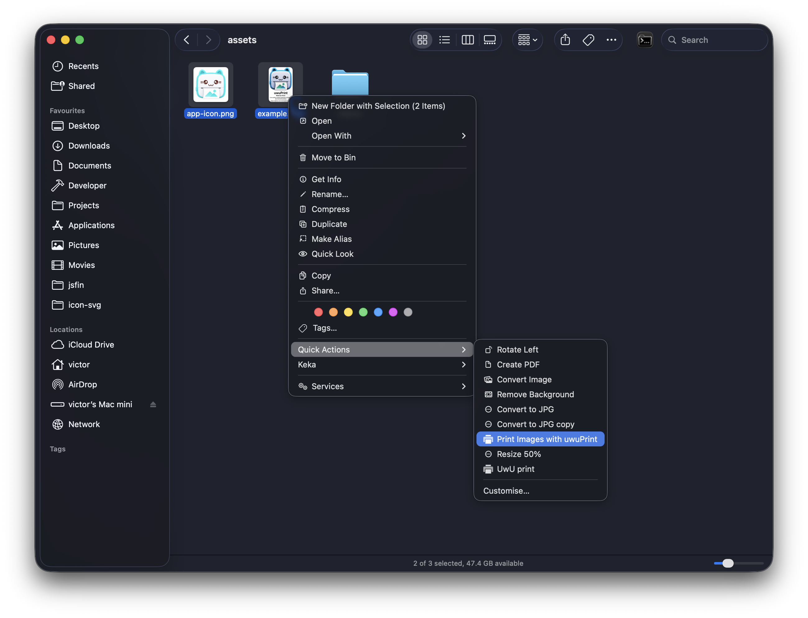
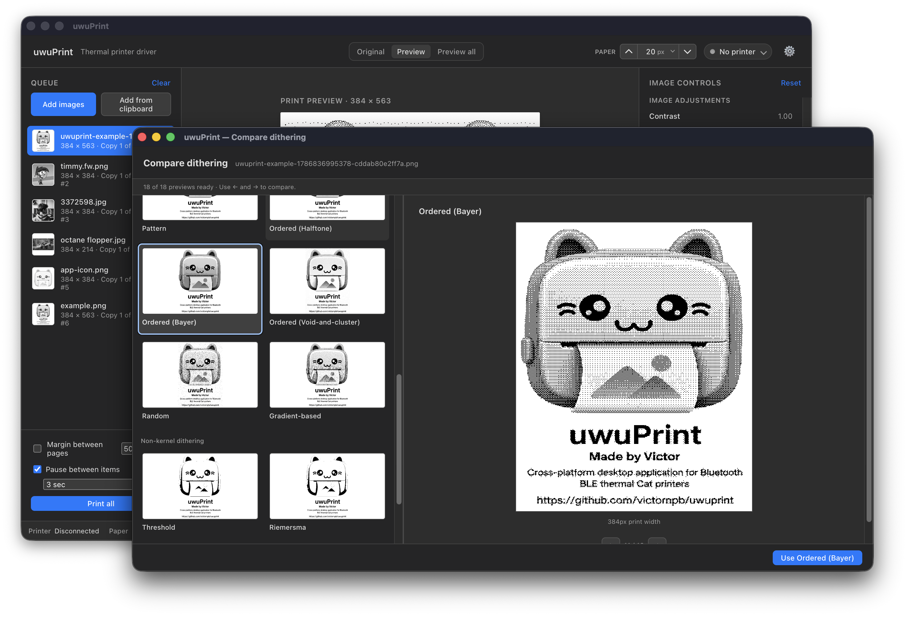
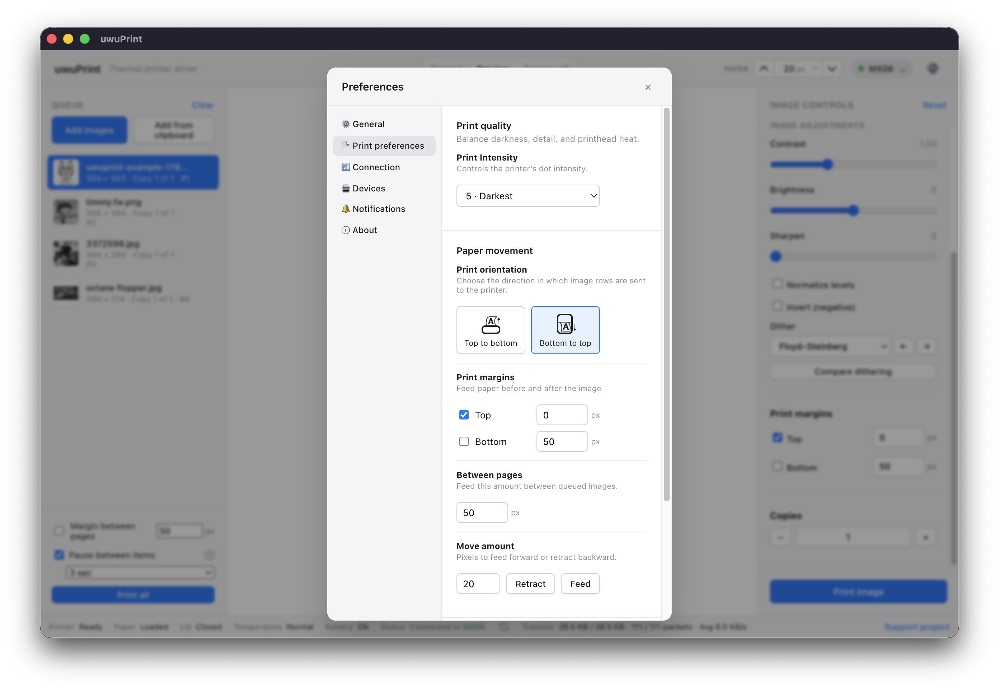
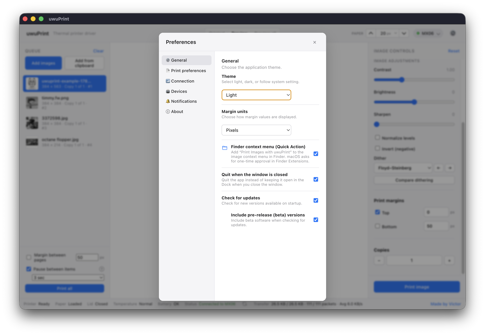
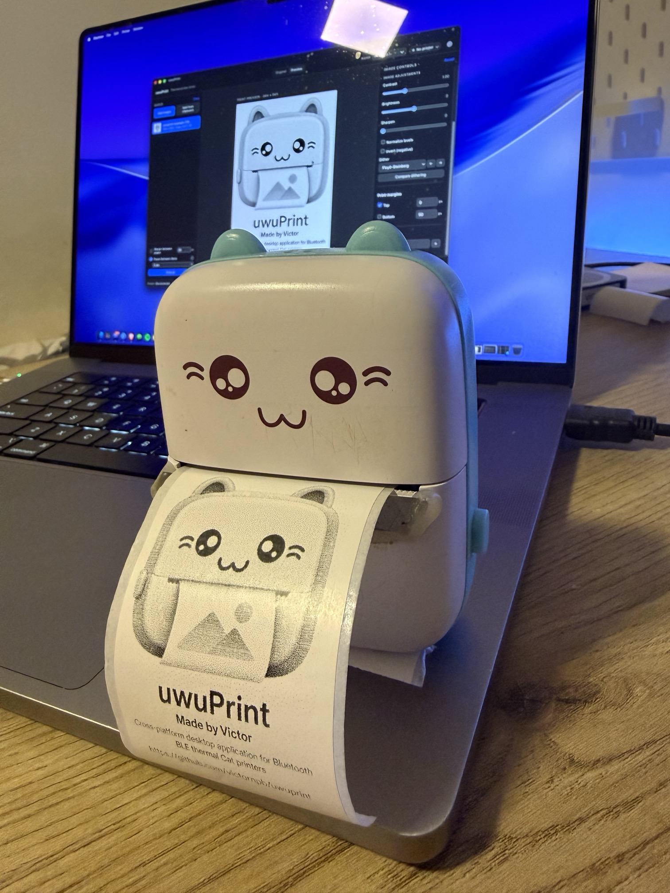

# uwuPrint

A desktop application for 1-click printing to Bluetooth thermal printers. Available for macOS, Windows, and Linux.

[Download for macOS](https://github.com/victornpb/uwuprint/releases) ·
[Download for Windows](https://github.com/victornpb/uwuprint/releases) ·
[Download for Linux](https://github.com/victornpb/uwuprint/releases)

<p align="center">
  
</p>

## Features

- **1-Click Printing**: Send images directly to the app using macOS Finder Quick Actions or Windows Explorer context menus for instant printing.
- **Print Preview**: Converts images to the printer's 384-pixel format to preview the exact output before printing.
- **Image Adjustments**: Controls for contrast, brightness, and sharpening. Includes multiple dithering algorithms with a comparison view, image inversion, and level normalization.
- **Queue Management**: Queue multiple images, set print margins, adjust spacing between prints, and specify the number of copies. Includes manual paper feed and retract controls.
- **Supported Formats**: PNG, JPEG, WebP, GIF, TIFF, and BMP. Support for drag-and-drop and pasting from the clipboard.

<p align="center">
  
</p>

<p align="center">
  
</p>

## Settings

Configure application behavior and printer defaults in the Preferences:
- Light, dark, or system-matched themes.
- Print direction, feed margins, and margin units.
- Between-page spacing and print intensity.

<p align="center">
  
</p>

<p align="center">
  
</p>

## Download

Downloads are available on the [GitHub Releases](https://github.com/victornpb/uwuprint/releases) page:

| Platform | Packages |
| --- | --- |
| [macOS](https://github.com/victornpb/uwuprint/releases) | DMG and ZIP |
| [Windows](https://github.com/victornpb/uwuprint/releases) | Installer and portable EXE |
| [Linux](https://github.com/victornpb/uwuprint/releases) | AppImage and DEB |

## Compatibility

uwuPrint supports various Bluetooth thermal "cat printers". It discovers nearby compatible devices and displays connection status, paper presence, lid status, temperature, battery level, and transfer progress.

| Model | Status |
| --- | --- |
| `_ZZ00` | ❓ Untested |
| `GB01` | ❓ Untested |
| `GB02` | ❓ Untested |
| `GB03` | ❓ Untested |
| `GT01` | ❓ Untested |
| `MX05` | ❓ Untested |
| `MX06` | ✅ Tested |
| `MX08` | ❓ Untested |
| `MX09` | ❓ Untested |
| `YT01` | ❓ Untested |

> **Did you test with another model?** Please [open an issue](https://github.com/victornpb/uwuprint/issues) to let us know if it works, so we can update this list!

<p align="center">
  
</p>

## Build from source

This repository contains the Electron and Vue application.

```sh
npm install
AGENT=1 npm run dev
```

Useful commands:

```sh
AGENT=1 npm run test        # Check entrypoints and build the renderer
AGENT=1 npm start           # Build and launch the production app
AGENT=1 npm run make:mac    # Package macOS as DMG
AGENT=1 npm run make:win    # Package Windows as installer and portable EXE
AGENT=1 npm run make:linux  # Package Linux as AppImage and DEB
AGENT=1 npm run make        # Package macOS, Windows, and Linux
```

## License

This project is currently distributed as an unlicensed, private-use application.
